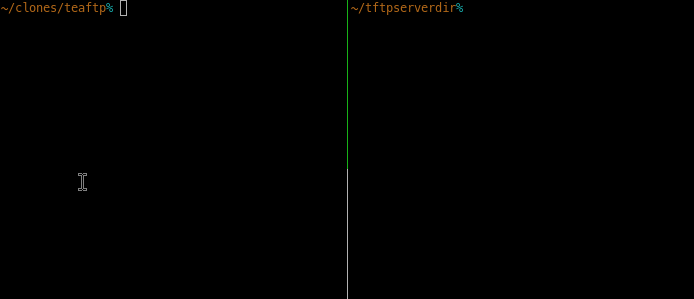

# TeaFTP 

Simple, read-only TFTP server.

* Will happily share ANY file on the system, but does not have acccess to write to any file.
  * Use the provided Docker container for a way to serve only a limited selection of files.
  * Or use the whitelist feature, as described below.
* TeaFTP may be suitable for dealing with hardware devices that read files over TFTP at boot.
* Every access is logged to stdout.

### Requirements

    Go >= 1.11

### Installation

    go get github.com/xyproto/teaftp

### Running

#### Directly

In the directory where you wish to share files:

Either:

    sudo ./teaftp

Or as root or with the correct Linux capabilities:

    ./teaftp

#### Whitelist

Any arguments given to TeaFTP are added to the whitelist of allowed filename suffixes. If no arguments are given, the whitelist is not in use.

Example:

    sudo ./teaftp ".txt"

This only serves filenames ending with `.txt`.

#### Through Docker

Make sure `dockerd` is running, then:

    git clone https://github.com/xyproto/teaftp
    cd teaftp/docker
    ./build_teaftp.sh
    ./run_teaftp.sh ./

The files in `./` can then be accessed with ie. `curl`, or another TFTP client:

    curl tftp://localhost/srv/example.txt

### License

MIT

### Uses

* [pin/tftp](https://github.com/pin/tftp)
* [sirupsen/logrus](https://github.com/sirupsen/logrus)

### Version

1.1.0
